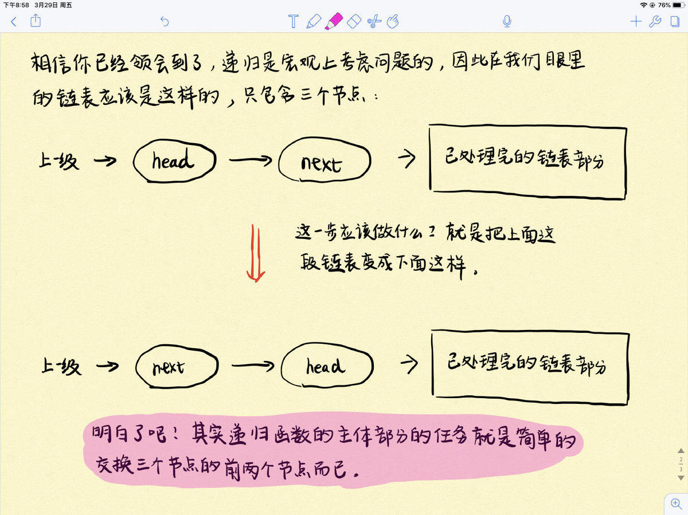

# LeetCode第 24号问题：两两交换链表中的节点

### 题目描述

题目链接：https://leetcode-cn.com/problems/swap-nodes-in-pairs/

给定一个链表，两两交换其中相邻的节点，并返回交换后的链表。

你不能只是单纯的改变节点内部的值，而是需要实际的进行节点交换。

示例:

```
给定 1->2->3->4, 你应该返回 2->1->4->3.
```

### 题目解析

**解法一：**

使用递归来做。套用递归解题三部曲模板：

1.  **找终止条件**。什么情况下递归终止？没得交换的时候，递归就终止了呗。因此当链表只剩一个节点或者没有节点的时候，自然递归就终止了。
2.  **找返回值**。我们希望向上一级递归返回什么信息？由于我们的目的是两两交换链表中相邻的节点，因此自然希望交换给上一级递归的是已经完成交换处理，即已经处理好的链表。
3.  **本级递归应该做什么。**结合第二步，看下图！由于只考虑本级递归，所以这个链表在我们眼里其实也就三个节点：head、head.next、已处理完的链表部分。而本级递归的任务也就是交换这3个节点中的前两个节点，就很easy了。




**解法二：**

该题属于基本的链表操作题。

- 设置一个虚拟头结点`dummyHead `
- 设置需要交换的两个节点分别为`node1 `、`node2`，同时设置`node2`的下一个节点`next`

##### 在这一轮操作中

- 将`node2`节点的next设置为`node1`节点
- 将`node1`节点的next设置为`next `节点
- 将`dummyHead `节点的next设置为`node2 `
- 结束本轮操作

接下来的每轮操作都按照上述进行。

### 动画描述


### 

### 代码实现

Python版本实现：

```
# Definition for singly-linked list.
# class ListNode(object):
#     def __init__(self, x):
#         self.val = x
#         self.next = None

class Solution(object):
    def swapPairs(self, head):
        """
        :type head: ListNode
        :rtype: ListNode
        """
        # 终止条件
        if head == None or head.next == None:
            return head
        
        # 本级递归
        next = head.next
        head.next = self.swapPairs(next.next)
        next.next = head
        
        # 返回值：已排好序的列表
        return next
```

```
// 24. Swap Nodes in Pairs
// https://leetcode.com/problems/swap-nodes-in-pairs/description/
// 时间复杂度: O(n)
// 空间复杂度: O(1)
class Solution {
public:
    ListNode* swapPairs(ListNode* head) {

        ListNode* dummyHead = new ListNode(0);
        dummyHead->next = head;

        ListNode* p = dummyHead;
        while(p->next && p->next->next){
            ListNode* node1 = p->next;
            ListNode* node2 = node1->next;
            ListNode* next = node2->next;
            node2->next = node1;
            node1->next = next;
            p->next = node2;
            p = node1;
        }

        ListNode* retHead = dummyHead->next;
        delete dummyHead;

        return retHead;
    }
};
```

  