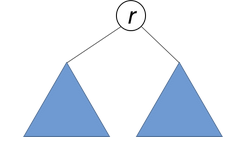
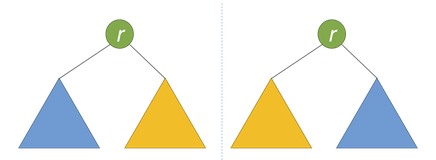

# LeetCode第101号问题：对称二叉树

### 题目描述

题目链接：https://leetcode-cn.com/problems/symmetric-tree/

给定一个二叉树，检查它是否是镜像对称的。

示例:

```
例如，二叉树 [1,2,2,3,4,4,3] 是对称的。

    1
   / \
  2   2
 / \ / \
3  4 4  3

但是下面这个 [1,2,2,null,3,null,3] 则不是镜像对称的:

    1
   / \
  2   2
   \   \
   3    3

说明:
如果你可以运用递归和迭代两种方法解决这个问题，会很加分。
```

### 题目解析

如果一个树的左子树与右子树镜像对称，那么这个树是对称的。



因此，该问题可以转化为：两个树在什么情况下互为镜像？

如果同时满足下面的条件，两个树互为镜像：

1、它们的两个根结点具有相同的值。
2、每个树的右子树都与另一个树的左子树镜像对称。



就像人站在镜子前审视自己那样。镜中的反射与现实中的人具有相同的头部，但反射的右臂对应于人的左臂，反之亦然。

使用递归来做。套用递归解题三部曲模板：

1.  **找终止条件**。当两棵树的节点都为空时返回True，若有一个为空，另一个不为空返回False
2.  **找返回值**。返回两个节点的值是否相等
3.  **本级递归应该做什么。** 判断两个节点的值是否相等，若相等，继续递归左子树是否等于另一个节点右子树，并且 右子树是否等于另一个节点左子树


### 代码实现

Python版本实现：

```
# Definition for a binary tree node.
# class TreeNode(object):
#     def __init__(self, x):
#         self.val = x
#         self.left = None
#         self.right = None

class Solution(object):
    def is_mirror(self, p, q):
        # 终止条件
        if p == None and q == None:
            return True
        if p == None or q == None:
            return False
        # 本级递归
        if p.val == q.val:
            return self.is_mirror(p.left, q.right) and self.is_mirror(p.right,q.left)
        return False
        
    def isSymmetric(self, root):
        """
        :type root: TreeNode
        :rtype: bool
        """
        return self.is_mirror(root,root)
        
```

Java版本实现

```
class Solution {
    public boolean isSymmetric(TreeNode root) {
        if(root == null) return true;
        //把问题变成判断两棵树是否是对称的
        return isSym(root.left, root.right);
    }
    //判断的是根节点为r1和r2的两棵树是否是对称的
    public boolean isSym(TreeNode r1, TreeNode r2){
        if(r1 == null && r2 == null) return true;
        if(r1 == null || r2 == null) return false;
        //这两棵树是对称需要满足的条件：
        //1.俩根节点相等。 2.树1的左子树和树2的右子树，树2的左子树和树1的右子树都得是对称的
        return r1.val == r2.val && isSym(r1.left, r2.right) 
                            && isSym(r1.right, r2.left);
    }
}
```

  