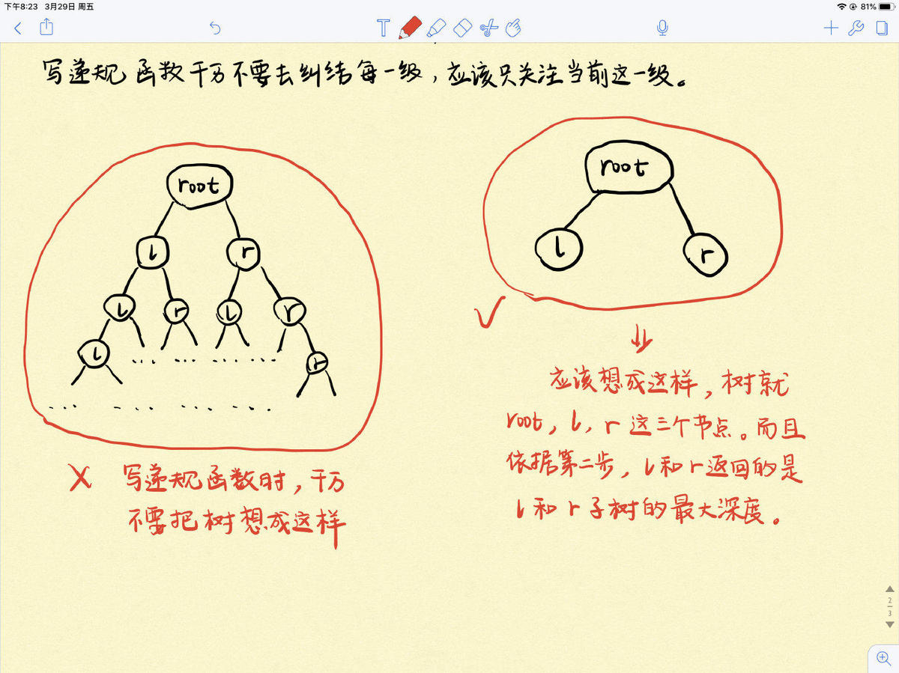

# LeetCode 第 104号问题：二叉树的最大深度

### 题目描述

题目链接：https://leetcode-cn.com/problems/maximum-depth-of-binary-tree/

给定一个二叉树，找出其最大深度。

二叉树的深度为根节点到最远叶子节点的最长路径上的节点数。

说明: 叶子节点是指没有子节点的节点。

示例：
给定二叉树 [3,9,20,null,null,15,7]，

        3
       / \
      9  20
        /  \
       15   7
返回它的最大深度 3 。

### 题目解析

使用递归来做。套用递归解题三部曲模板：

1.  **找终止条件**。什么情况下递归结束？当然是树为空的时候，此时树的深度为0，递归就结束了。
2.  **找返回值**。应该返回什么？题目求的是树的最大深度，我们需要从每一级得到的信息自然是当前这一级对应的树的最大深度，因此我们的返回值应该是当前树的最大深度，这一步可以结合第三步来看。
3.  **本级递归应该做什么**。首先，还是强调要走出之前的思维误区，递归后我们眼里的树一定是这个样子的，看下图。此时就三个节点：root、root.left、root.right，其中根据第二步，root.left和root.right分别记录的是root的左右子树的最大深度。那么本级递归应该做什么就很明确了，自然就是在root的左右子树中选择较大的一个，再加上1就是以root为根的子树的最大深度了，然后再返回这个深度即可。



### 代码实现

Python版本实现：

```
# Definition for a binary tree node.
# class TreeNode(object):
#     def __init__(self, x):
#         self.val = x
#         self.left = None
#         self.right = None

class Solution(object):
    def maxDepth(self, root):
        """
        :type root: TreeNode
        :rtype: int
        """
        return 0 if root == None else max(self.maxDepth(root.left),self.maxDepth(root.right)) + 1
```


  