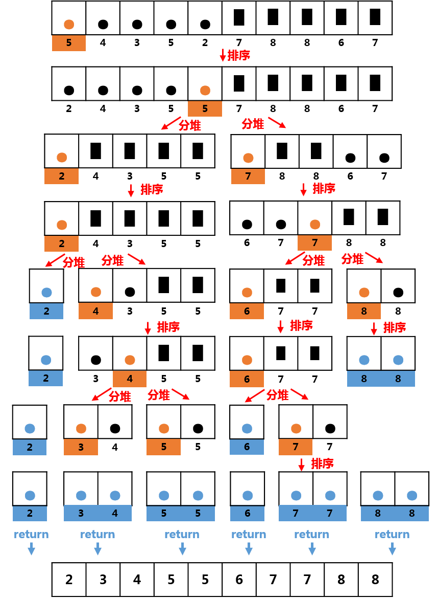

# 面试 第 3 号问题：快速排序

> 面试题收集

### 题目描述

给定一个整数数组 `nums` 请你对这个数组进行排序，并将结果进行返回。

**示例:**

```
给定 nums = [5，4，3，5，2，7，8，8，6，7]
返回 [2，3，4，5，5，6，7，7，8，8]
```

### 题目解析

使用快速排序对数组进行排序，随机找出一个数，可以随机取，也可以取固定位置，一般是取第一个或最后一个称为基准，然后就是比基准小的在左边，比基准大的放到右边，如何放做，就是和基准进行交换，这样交换完左边都是比基准小的，右边都是比较基准大的，这样就将一个数组分成了两个子数组，然后再按照同样的方法把子数组再分成更小的子数组，直到不能分解为止。

例子：[5，4，3，5，2，7，8，8，6，7]



### 代码实现

```
// 选择排序
public class QuickSort {

		public void quickSort(int R[],int l,int r)
		{
			    int temp;
			    int i=l, j=r;
			    if(l < r)
			    {
			        temp = R[l]; // 以左边的一个数作为枢轴
			        while(i!=j)
			        {
			            while(j > i && R[j] > temp) --j;
			            if(i < j)
			            {
			                R[i] = R[j];
			                ++i;
			            }
			            while(j > i && R[i] < temp) ++i;
			            if(i < j)
			            {
			                R[j] = R[i];
			                --j;
			            }
			        }
			        R[i] = temp;
			        quickSort(R, l,i-1);
			        quickSort(R,i+1,r);
			    }
		}
		
		public static void main(String[] args) {
				QuickSort sort =new QuickSort();
				 int R[] = {0,6,4,5,7,8};
				 sort.quickSort(R, 0, R.length-1);
				 for (int i : R){
					 System.out.println(i);
				 }	
		}

}

```


  